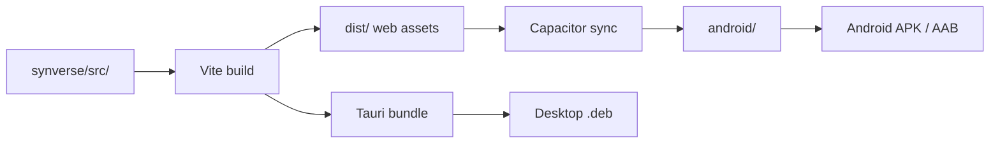
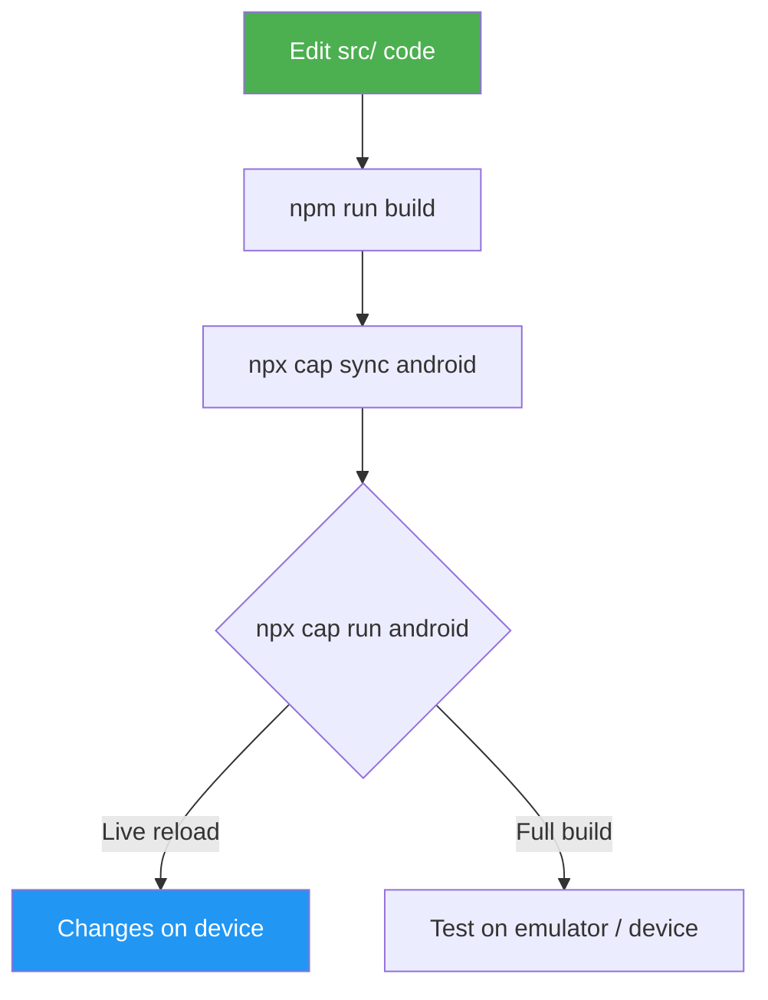

# Synverse for Android

Capacitor-based Android wrapper for the Synverse chat client.
The shared React codebase (in `src/`) runs on three platforms — web, Tauri desktop, and Capacitor Android — with platform-specific behaviour handled by the utility modules.

---

## Architecture

```
synverse/
├── src/                        # Shared React codebase (web + Android + Tauri)
│   ├── components/
│   │   ├── ErrorBoundary.jsx   # Catches rendering errors to avoid white-screen crashes
│   │   ├── Header.jsx
│   │   ├── MessageInput.jsx
│   │   ├── MessageList.jsx     # Includes KaTeX math rendering
│   │   └── Sidebar.jsx
│   ├── contexts/
│   │   ├── ConversationContext.jsx
│   │   ├── OllamaContext.jsx    # Uses networkAdapter for all HTTP
│   │   └── SettingsContext.jsx  # Uses storageAdapter for persistence
│   ├── pages/
│   │   ├── ChatPage.jsx
│   │   └── SettingsPage.jsx
│   ├── utils/
│   │   ├── platform.js         # Multi-platform detection (Capacitor + Tauri)
│   │   ├── networkAdapter.js   # Transparent HTTP: web fetch, CapacitorHttp, Tauri HTTP
│   │   ├── storageAdapter.js   # localStorage ↔ Capacitor Preferences bridge
│   │   └── fileUtils.js        # Lazy-loads pdfjs-dist on first PDF use
│   ├── main.jsx                # Router choice: BrowserRouter (web/Capacitor) / HashRouter (Tauri)
│   ├── App.jsx                 # Dark-only theme, sidebar state, lazy-loaded routes
│   └── index.css               # Plus Jakarta Sans, KaTeX overrides, scrollbar styling
├── src-tauri/                  # Tauri desktop wrapper (separate build target)
├── android/                    # Generated by Capacitor (npx cap add android)
│   └── app/src/main/
│       ├── AndroidManifest.xml # ← edited: cleartext, permissions
│       └── res/xml/
│           └── network_security_config.xml  # ← added: HTTP allowed
├── android-app/                # Scripts & documentation (not generated)
│   ├── README.md               # You are here
│   └── scripts/
│       ├── setup.sh
│       ├── build-and-sync.sh
│       └── open-android.sh
├── capacitor.config.ts         # Capacitor configuration (project root)
├── vite.config.js
└── package.json
```

The web app at `src/` is the single source of truth.
Changes to the UI, contexts, and utils are shared between web, Android, and desktop — no code duplication.



---

## Prerequisites

| Tool | Minimum version | Purpose |
|------|----------------|---------|
| Node.js | 18+ | Build the web app |
| npm | 9+ | Package management |
| Android Studio | Hedgehog (2023.1.1)+ | Android SDK, emulator, signing |
| Android SDK | API 34 (Android 14) | Target platform |
| Java / JDK | 17 | Android Gradle plugin |
| Gradle | 8.x | Bundled via Android Studio |

> **Tip:** Install Android Studio via [the official site](https://developer.android.com/studio) — it includes the SDK manager, emulator, and build tools.

---

## Quick start

### 1. Install dependencies

```bash
# From the synverse/ root
npm install

# Capacitor packages (already in package.json — this is idempotent)
npm install @capacitor/core @capacitor/cli @capacitor/android \
  @capacitor/preferences @capacitor/network @capacitor/haptics @capacitor/status-bar
```

### 2. Initialise the Android platform

```bash
# Build the web app first
npm run build

# Add the Android platform (creates android/)
npx cap add android

# Sync web assets into the Android project
npx cap sync android
```

### 3. Run on device / emulator

```bash
# Open in Android Studio
npx cap open android

# Or run directly via the CLI
npx cap run android
```

### 4. Or use the convenience scripts

```bash
# First-time setup (installs deps, builds, adds platform, syncs)
bash android-app/scripts/setup.sh

# Build web app, sync, and assemble debug APK
bash android-app/scripts/build-and-sync.sh

# Open in Android Studio
bash android-app/scripts/open-android.sh
```

---

## Capacitor configuration

`capacitor.config.ts` (project root):

```ts
import type { CapacitorConfig } from "@capacitor/cli";

const config: CapacitorConfig = {
  appId: "com.synverse.app",
  appName: "Synverse",

  // Vite build output — relative to this config file (project root)
  webDir: "dist",

  server: {
    // Serve from bundled assets in production (no local dev server needed).
    // For live-reload during development, use: npx cap run android --livereload --external
    //
    // Use "https" scheme so the WebView origin is https://localhost rather
    // than the default http://localhost.  This avoids mixed-content warnings
    // when the app calls https://ollama.com from the WebView and ensures
    // cookies / storage APIs that require a secure context continue to work.
    androidScheme: "https",
  },

  // Route non-streaming fetch() calls through the native HTTP client
  // on Android.  This bypasses WebView CORS restrictions.
  //
  // NOTE: fetch patching is DISABLED because it buffers the entire
  // response, which breaks streaming for the /api/chat endpoint.
  // Instead, the networkAdapter.js uses CapacitorHttp.request() directly
  // for non-streaming calls and for the chat endpoint.
  plugins: {
    CapacitorHttp: {
      enabled: false,
    },
    SplashScreen: {
      launchShowDuration: 1000,
      backgroundColor: "#121212",
      showSpinner: true,
      spinnerColor: "#14b8a6",
    },
    StatusBar: {
      style: "DARK",
      backgroundColor: "#0b0d13",
    },
  },
};

export default config;
```

---

## Platform-specific adaptations

The following changes have been applied to the shared codebase so the web app continues to work unchanged in the browser while also running correctly on Android. The same codebase also powers the Tauri desktop build; Tauri-specific code paths are guarded by `isTauriPlatform()` and are inert on Android.

### 1. Storage: localStorage → Capacitor Preferences

On Android, `localStorage` may be cleared by the OS and doesn't persist across app updates. The storage adapter at `src/utils/storageAdapter.js` provides a unified async API:

| Platform | Backend |
|----------|---------|
| Web / Tauri | `localStorage` (instant, synchronous) |
| Android | `@capacitor/preferences` (async, persistent) |

All contexts (`SettingsContext`, `OllamaContext`) now use the adapter. On web/Tauri the async calls resolve immediately (a thin wrapper around `localStorage`), so there is no perceptible delay. On native, settings are loaded from persistent storage after mount.

**Files changed:**
- `src/utils/storageAdapter.js` — async adapter (web falls through to `localStorage`)
- `src/contexts/SettingsContext.jsx` — uses `getItem`/`setItem`
- `src/contexts/OllamaContext.jsx` — uses `getItem`/`setItem`

> **Note:** The theme toggle was removed in the latest update. The app is now dark-only. The previous `App.jsx` theme persistence code has been removed — `SettingsContext` and `OllamaContext` still use the storage adapter.

### 2. Platform detection: proxy defaults

On Android the Vite dev-server proxy (`/ollama-api`) does not exist. The platform utility at `src/utils/platform.js` detects whether the app is running on a native platform:

| Platform | `useProxy` default | Default URL |
|----------|-------------------|-------------|
| Web | `true` (dev proxy strips CORS) | `http://localhost:11434` |
| Android (Capacitor) | `false` (direct connection) | `http://192.168.1.1:11434` |
| Tauri desktop | `false` (reqwest bypasses CORS) | `http://localhost:11434` |

Users configure their actual Ollama server IP in the Settings page.

**Files changed:**
- `src/utils/platform.js` — `isNativePlatform()`, `isTauriPlatform()`, `getDefaultOllamaUrl()`, `shouldUseProxyByDefault()`
- `src/contexts/OllamaContext.jsx` — imports from `platform.js`, uses `loaded` guard

### 3. Network security: cleartext HTTP

Android 9+ blocks cleartext (non-HTTPS) traffic by default. Since users connect to Ollama on their LAN via `http://`, this must be allowed:

**Files changed:**
- `android/app/src/main/AndroidManifest.xml` — added `android:usesCleartextTraffic="true"` and `android:networkSecurityConfig="@xml/network_security_config"`
- `android/app/src/main/res/xml/network_security_config.xml` — new file, permits cleartext
- `android/app/src/main/AndroidManifest.xml` — added `ACCESS_NETWORK_STATE` permission

### 4. Network adapter: transparent HTTP for web, Android, and Tauri

The `networkAdapter.js` module routes HTTP requests to the correct backend based on the platform:

| Platform | Non-streaming | Streaming |
|----------|--------------|-----------|
| Web | browser `fetch` (optionally via Vite proxy) | `fetch` + `ReadableStream` |
| Android (Capacitor) | `CapacitorHttp.request()` | Full response via `CapacitorHttp` (`stream: false`) |
| Tauri desktop | `@tauri-apps/plugin-http` `fetch` (lazy-loaded) | Tauri `fetch` + `ReadableStream` |

On Android, `CapacitorHttp` bypasses WebView CORS entirely. On Tauri, the HTTP plugin routes through `reqwest` (Rust), which also has no CORS restrictions.

#### Ollama Cloud API: User-Agent bypass

Ollama's cloud endpoint (`ollama.com`) employs bot-detection that blocks requests carrying Android's default HTTP User-Agent (`Dalvik/2.1.0 …`) with an HTTP 403 response. The `withBrowserUA()` helper in `networkAdapter.js` injects a platform-appropriate browser User-Agent:

| Platform | User-Agent |
|----------|-----------|
| Android | Chrome-on-Android string |
| Tauri | Chrome-on-Linux string |

This is purely a header change — the request body and authentication are untouched.

Additionally, `capacitor.config.ts` sets `androidScheme: "https"` so the WebView origin is `https://localhost` instead of the default `http://localhost`. This avoids mixed-content warnings when the app calls `https://ollama.com` from the WebView.

**Files changed:**
- `src/utils/networkAdapter.js` — `withBrowserUA()` helper, three-way dispatch (web / Capacitor / Tauri)

### 5. Router: BrowserRouter for web and Android, HashRouter for Tauri

`src/main.jsx` selects the router based on the platform:

```js
const isTauri = typeof window !== "undefined" && "__TAURI_INTERNALS__" in window;
const Router = isTauri ? HashRouter : BrowserRouter;
```

- **Web and Android** use `BrowserRouter` — standard client-side routing, works with the Capacitor WebView.
- **Tauri desktop** uses `HashRouter` — Tauri serves files via a custom protocol with no server-side rewrite, so history-API routes like `/settings` would 404 on refresh.

On Android, `BrowserRouter` works correctly because Capacitor's local server serves `index.html` for all paths within the app origin.

**Files changed:**
- `src/main.jsx` — conditional router selection, `ErrorBoundary` wrapper, global error handlers

### 6. ErrorBoundary: preventing white-screen crashes

`src/components/ErrorBoundary.jsx` is a React error boundary that catches rendering errors and displays them with a reload button instead of crashing to a blank screen. On Android this is especially important because there is no way to open devtools on a production device — the boundary makes errors visible and recoverable.

**Files changed:**
- `src/components/ErrorBoundary.jsx` — new file

### 7. Dark-only theme

The app now uses a fixed dark theme (inspired by AnythingLLM) with teal (`#14b8a6`) as the accent colour. The light/dark toggle has been removed. This simplifies the theme logic and ensures a consistent experience across platforms.

The theme is defined inline in `src/App.jsx` using `createTheme()` with full MUI component overrides.

### 8. Math rendering (KaTeX)

The `MessageList` component renders LaTeX math in assistant messages using `remark-math` + `rehype-katex`. The KaTeX CSS is bundled by Vite via `import "katex/dist/katex.min.css"`. This works in the Android WebView.

**Dependencies added:**
- `remark-math`
- `rehype-katex`
- `katex` (peer dependency of `rehype-katex`)

### 9. PDF text extraction (lazy-loaded)

`pdfjs-dist` is now lazy-loaded on first PDF use instead of statically imported. This reduces the initial bundle size by ~800 KB. The dynamic `import()` works in the Android WebView.

**Files changed:**
- `src/utils/fileUtils.js` — `getPdfjs()` async helper lazily imports `pdfjs-dist`

### 10. File attachments

`fileUtils.js` uses `FileReader.readAsDataURL()` and `FileReader.readAsArrayBuffer()`. These work inside the Android WebView. No changes needed for basic functionality.

---

## Building a release APK

### 1. Generate a signing key

```bash
keytool -genkey -v \
  -keystore synverse-release-key.jks \
  -keyalg RSA \
  -keysize 2048 \
  -validity 10000 \
  -alias synverse
```

Store `synverse-release-key.jks` securely — **do not commit it**. It's already in `.gitignore`.

### 2. Configure signing in Gradle

Edit `android/app/build.gradle`:

```groovy
android {
    ...
    signingConfigs {
        release {
            storeFile file("../../../synverse-release-key.jks")
            storePassword System.getenv("KEYSTORE_PASSWORD")
            keyAlias "synverse"
            keyPassword System.getenv("KEY_PASSWORD")
        }
    }
    buildTypes {
        release {
            signingConfig signingConfigs.release
            minifyEnabled true
            proguardFiles getDefaultProguardFile("proguard-android-optimize.txt"), "proguard-rules.pro"
        }
    }
}
```

### 3. Build and sign

```bash
# Build the web app
npm run build
npx cap sync android

# Build the release APK via Gradle
cd android
./gradlew assembleRelease

# Output: android/app/build/outputs/apk/release/app-release.apk
```

For a Play Store bundle (AAB):

```bash
./gradlew bundleRelease

# Output: android/app/build/outputs/bundle/release/app-release.aab
```

---

## Development workflow



### Live reload during development

For hot-reload while developing on a connected Android device:

```bash
# Terminal 1 — start the Vite dev server
npm run dev

# Terminal 2 — tell Capacitor to use the dev server
npx cap run android --livereload --external
```

This serves web content from the Vite dev server over the network. Changes to `src/` are reflected instantly on the device.

> **Important:** When using `--livereload`, the app connects to `http://<your-ip>:3000`. Make sure your phone and computer are on the same Wi-Fi network, and that the Vite dev server's proxy is working (or `useProxy` is set to `false` in Settings).

---

## Project structure — what goes where

| Path | Purpose | Edit? |
|------|---------|-------|
| `synverse/src/` | Shared app code (components, contexts, utils) | ✅ Yes — main codebase |
| `synverse/capacitor.config.ts` | Capacitor settings | ✅ Yes |
| `synverse/src-tauri/` | Tauri desktop wrapper | ✅ Yes (desktop build only) |
| `synverse/android/` | Generated Android project | ⚠️ Only `AndroidManifest.xml` and `res/xml/` |
| `synverse/android-app/scripts/` | Build/setup convenience scripts | ✅ Yes |
| `synverse/vite.config.js` | Web app build config | ✅ Yes |

### `.gitignore`

```
node_modules/
dist/
android/
src-tauri/target/
*.jks
```

The `android/` directory is generated by `npx cap add android`. Commit it **only after** initial customisation (permissions, signing config, icons). After that, `npx cap sync` will overwrite web assets but preserve your native changes.

---

## Checklist — from web app to Play Store

- [x] Install Capacitor dependencies (`@capacitor/core`, `@capacitor/cli`, `@capacitor/android`, `@capacitor/preferences`, `@capacitor/network`, `@capacitor/haptics`, `@capacitor/status-bar`)
- [x] Create `capacitor.config.ts` at project root
- [x] Refactor `localStorage` calls to use the async storage adapter (`src/utils/storageAdapter.js`)
- [x] Add `Capacitor.isNativePlatform()` checks for proxy default (`src/utils/platform.js`)
- [x] Change default Ollama URL for native platforms to a LAN address
- [x] Add `ErrorBoundary` component for crash recovery
- [x] Switch to dark-only theme (removed light/dark toggle)
- [x] Add KaTeX math rendering support
- [x] Lazy-load `pdfjs-dist` to reduce initial bundle
- [x] Add `androidScheme: "https"` to `capacitor.config.ts`
- [x] Build web app (`npm run build`)
- [x] Add Android platform (`npx cap add android`)
- [x] Add `android:usesCleartextTraffic="true"` and `android:networkSecurityConfig` to AndroidManifest.xml
- [x] Add `ACCESS_NETWORK_STATE` permission to AndroidManifest.xml
- [x] Add `network_security_config.xml` to allow HTTP connections
- [x] Sync assets (`npx cap sync android`)
- [ ] Test on emulator (`npx cap run android`)
- [ ] Test on physical device (Ollama on same LAN)
- [ ] Customise app icon and splash screen
- [ ] Generate signing keystore
- [ ] Configure release signing in `build.gradle`
- [ ] Build release AAB (`./gradlew bundleRelease`)
- [ ] Create Play Store listing and upload AAB

---

## Troubleshooting

| Problem | Solution |
|---------|----------|
| `cap add android` fails | Ensure `dist/` exists (`npm run build` first) |
| White screen on launch | Check `capacitor.config.ts` → `webDir` is `"dist"`. Also check the browser console via Chrome remote debugging — the `ErrorBoundary` should now display errors instead of a blank page |
| Network requests fail on device | Confirm `android:usesCleartextTraffic="true"` and `network_security_config.xml` are set |
| Ollama connection refused | Make sure Ollama binds to `0.0.0.0` (not `127.0.0.1`) and the phone is on the same LAN |
| CORS errors on Android | Disable `useProxy` in settings; configure Ollama with `OLLAMA_ORIGINS=*` |
| `localStorage` data lost after update | Storage adapter now uses `@capacitor/preferences` on native — persistent across updates |
| PDF extraction crashes | Ensure the Vite build includes `pdf.worker.min.mjs` from `pdfjs-dist` (now lazy-loaded) |
| Build error: SDK not found | Open Android Studio → SDK Manager → install API 34 and Build Tools 34 |
| Settings flash on app start | Normal on first load — async storage reads default values first, then updates |
| Ollama Cloud returns 403 on Android | Ollama.com blocks requests with the default Android Dalvik User-Agent. The `networkAdapter.js` injects a browser-like `User-Agent` header into all Capacitor-native requests. Verify `src/utils/networkAdapter.js` includes `withBrowserUA()` and that `capacitor.config.ts` has `androidScheme: "https"` |
| KaTeX math not rendering | Ensure `katex/dist/katex.min.css` is bundled (it's imported in `MessageList.jsx`) |
| Google Fonts not loading offline | The Plus Jakarta Sans and JetBrains Mono fonts require internet on first load; the CSS `font-family` fallback is `system-ui, -apple-system, sans-serif` |