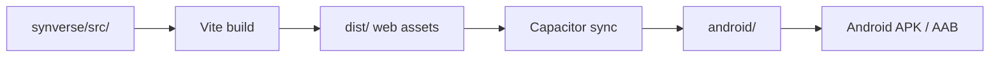
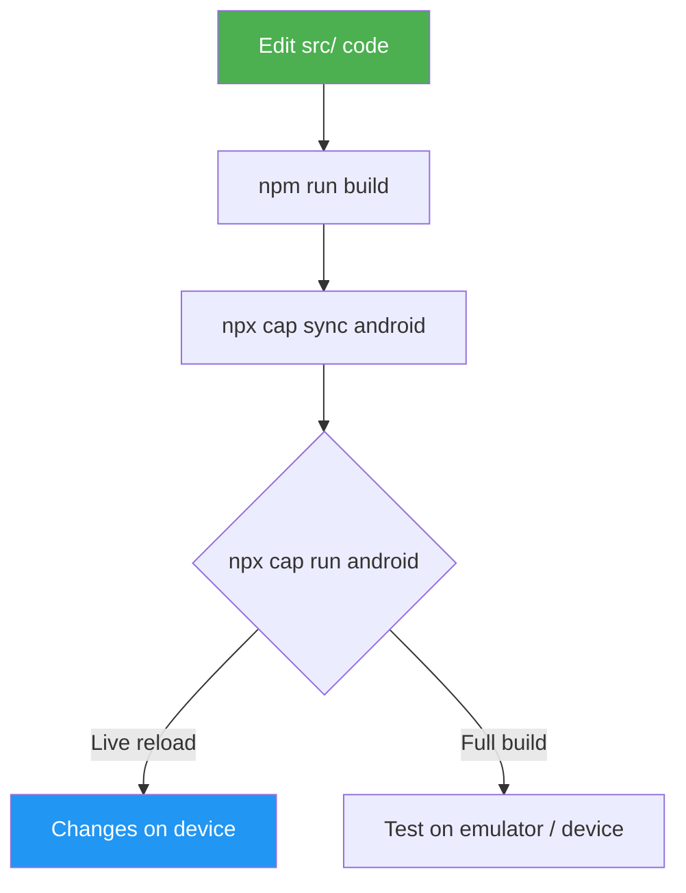

# Synverse for Android

Capacitor-based Android wrapper for the Synverse chat client.  
The existing React web app is built with Vite, then copied into a native Android shell that provides access to device APIs and Play Store distribution.

---

## Architecture

```
synverse/
├── src/                        # Shared React codebase (web + Android)
│   ├── components/
│   ├── contexts/
│   ├── pages/
│   ├── utils/
│   │   ├── platform.js         # Capacitor native-platform detection
│   │   ├── storageAdapter.js   # localStorage ↔ Capacitor Preferences bridge
│   │   └── fileUtils.js
│   └── ...
├── android/                    # Generated by Capacitor (npx cap add android)
│   └── app/src/main/
│       ├── AndroidManifest.xml # ← edited: cleartext, permissions
│       └── res/xml/
│           └── network_security_config.xml  # ← added: HTTP allowed
├── android-app/                # Scripts & documentation (not generated)
│   ├── README.md               # You are here
│   └── scripts/
│       ├── setup.sh
│       ├── build-and-sync.sh
│       └── open-android.sh
├── capacitor.config.ts        # Capacitor configuration (project root)
├── vite.config.js
└── package.json
```

The web app at `synverse/src/` is the single source of truth.  
Changes to the UI, contexts, and utils are shared between web and Android — no code duplication.



---

## Prerequisites

| Tool | Minimum version | Purpose |
|------|----------------|---------|
| Node.js | 18+ | Build the web app |
| npm | 9+ | Package management |
| Android Studio | Hedgehog (2023.1.1)+ | Android SDK, emulator, signing |
| Android SDK | API 34 (Android 14) | Target platform |
| Java / JDK | 17 | Android Gradle plugin |
| Gradle | 8.x | Bundled via Android Studio |

> **Tip:** Install Android Studio via [the official site](https://developer.android.com/studio) — it includes the SDK manager, emulator, and build tools.

---

## Quick start

### 1. Install dependencies

```bash
# From the synverse/ root
npm install

# Capacitor packages (already in package.json — this is idempotent)
npm install @capacitor/core @capacitor/cli @capacitor/android \
  @capacitor/preferences @capacitor/network @capacitor/haptics @capacitor/status-bar
```

### 2. Initialise the Android platform

```bash
# Build the web app first
npm run build

# Add the Android platform (creates android/)
npx cap add android

# Sync web assets into the Android project
npx cap sync android
```

### 3. Run on device / emulator

```bash
# Open in Android Studio
npx cap open android

# Or run directly via the CLI
npx cap run android
```

### 4. Or use the convenience scripts

```bash
# First-time setup (installs deps, builds, adds platform, syncs)
bash android-app/scripts/setup.sh

# Build web app and sync to Android
bash android-app/scripts/build-and-sync.sh

# Open in Android Studio
bash android-app/scripts/open-android.sh
```

---

## Capacitor configuration

`capacitor.config.ts` (project root):

```ts
import type { CapacitorConfig } from "@capacitor/cli";

const config: CapacitorConfig = {
  appId: "com.synverse.app",
  appName: "Synverse",
  webDir: "dist",                       // Vite output (relative to project root)
  server: {
    // For live-reload during development, use:
    // npx cap run android --livereload --external
  },
  plugins: {
    SplashScreen: {
      launchShowDuration: 1000,
      backgroundColor: "#121212",
      showSpinner: true,
      spinnerColor: "#1976d2",
    },
    StatusBar: {
      style: "DARK",
      backgroundColor: "#121212",
    },
  },
};

export default config;
```

---

## Platform-specific adaptations

The following changes have been applied to the shared codebase so the web app continues to work unchanged in the browser while also running correctly on Android.

### 1. Storage: localStorage → Capacitor Preferences

On Android, `localStorage` may be cleared by the OS and doesn't persist across app updates. The storage adapter at `src/utils/storageAdapter.js` provides a unified async API:

| Platform | Backend |
|----------|---------|
| Web | `localStorage` (instant, synchronous) |
| Android | `@capacitor/preferences` (async, persistent) |

All contexts (`SettingsContext`, `OllamaContext`, `App`) now use the adapter. On web the async calls resolve immediately (a thin wrapper around `localStorage`), so there is no perceptible delay. On native, settings are loaded from persistent storage after mount.

**Files changed:**
- `src/utils/storageAdapter.js` — new file, async adapter
- `src/contexts/SettingsContext.jsx` — uses `getItem`/`setItem`
- `src/contexts/OllamaContext.jsx` — uses `getItem`/`setItem`
- `src/App.jsx` — uses `getItem`/`setItem` for theme

### 2. Platform detection: proxy defaults

On Android the Vite dev-server proxy (`/ollama-api`) does not exist. The platform utility at `src/utils/platform.js` detects whether the app is running on a native platform:

| Platform | `useProxy` default | Default URL |
|----------|-------------------|-------------|
| Web | `true` (dev proxy strips CORS) | `http://localhost:11434` |
| Android | `false` (direct connection) | `http://192.168.1.1:11434` |

Users configure their actual Ollama server IP in the Settings page.

**Files changed:**
- `src/utils/platform.js` — new file, `isNativePlatform()`, `getDefaultOllamaUrl()`, `shouldUseProxyByDefault()`
- `src/contexts/OllamaContext.jsx` — imports from `platform.js`, uses `loaded` guard

### 3. Network security: cleartext HTTP

Android 9+ blocks cleartext (non-HTTPS) traffic by default. Since users connect to Ollama on their LAN via `http://`, this must be allowed:

**Files changed:**
- `android/app/src/main/AndroidManifest.xml` — added `android:usesCleartextTraffic="true"` and `android:networkSecurityConfig="@xml/network_security_config"`
- `android/app/src/main/res/xml/network_security_config.xml` — new file, permits cleartext
- `android/app/src/main/AndroidManifest.xml` — added `ACCESS_NETWORK_STATE` permission

### 4. File attachments

The current `fileUtils.js` uses `FileReader.readAsDataURL()` and `FileReader.readAsArrayBuffer()`. These work inside the Android WebView. No changes needed for basic functionality.

### 5. PDF text extraction

`pdfjs-dist` with its web worker works inside the Android WebView. No changes needed.

---

## Building a release APK

### 1. Generate a signing key

```bash
keytool -genkey -v \
  -keystore synverse-release-key.jks \
  -keyalg RSA \
  -keysize 2048 \
  -validity 10000 \
  -alias synverse
```

Store `synverse-release-key.jks` securely — **do not commit it**. It's already in `.gitignore`.

### 2. Configure signing in Gradle

Edit `android/app/build.gradle`:

```groovy
android {
    ...
    signingConfigs {
        release {
            storeFile file("../../../synverse-release-key.jks")
            storePassword System.getenv("KEYSTORE_PASSWORD")
            keyAlias "synverse"
            keyPassword System.getenv("KEY_PASSWORD")
        }
    }
    buildTypes {
        release {
            signingConfig signingConfigs.release
            minifyEnabled true
            proguardFiles getDefaultProguardFile("proguard-android-optimize.txt"), "proguard-rules.pro"
        }
    }
}
```

### 3. Build and sign

```bash
# Build the web app
npm run build
npx cap sync android

# Build the release APK via Gradle
cd android
./gradlew assembleRelease

# Output: android/app/build/outputs/apk/release/app-release.apk
```

For a Play Store bundle (AAB):

```bash
./gradlew bundleRelease

# Output: android/app/build/outputs/bundle/release/app-release.aab
```

---

## Development workflow



### Live reload during development

For hot-reload while developing on a connected Android device:

```bash
# Terminal 1 — start the Vite dev server
npm run dev

# Terminal 2 — tell Capacitor to use the dev server
npx cap run android --livereload --external
```

This serves web content from the Vite dev server over the network. Changes to `src/` are reflected instantly on the device.

> **Important:** When using `--livereload`, the app connects to `http://<your-ip>:3000`. Make sure your phone and computer are on the same Wi-Fi network, and that the Vite dev server's proxy is working (or `useProxy` is set to `false` in Settings).

---

## Project structure — what goes where

| Path | Purpose | Edit? |
|------|---------|-------|
| `synverse/src/` | Shared app code (components, contexts, utils) | ✅ Yes — main codebase |
| `synverse/capacitor.config.ts` | Capacitor settings | ✅ Yes |
| `synverse/android/` | Generated Android project | ⚠️ Only `AndroidManifest.xml` and `res/xml/` |
| `synverse/android-app/scripts/` | Build/setup convenience scripts | ✅ Yes |
| `synverse/vite.config.js` | Web app build config | ✅ Yes |

### `.gitignore`

```
node_modules/
dist/
android/
*.jks
```

The `android/` directory is generated by `npx cap add android`. Commit it **only after** initial customisation (permissions, signing config, icons). After that, `npx cap sync` will overwrite web assets but preserve your native changes.

---

## Checklist — from web app to Play Store

- [x] Install Capacitor dependencies (`@capacitor/core`, `@capacitor/cli`, `@capacitor/android`, `@capacitor/preferences`, `@capacitor/network`, `@capacitor/haptics`, `@capacitor/status-bar`)
- [x] Create `capacitor.config.ts` at project root
- [x] Refactor `localStorage` calls to use the async storage adapter (`src/utils/storageAdapter.js`)
- [x] Add `Capacitor.isNativePlatform()` checks for proxy default (`src/utils/platform.js`)
- [x] Change default Ollama URL for native platforms to a LAN address
- [x] Build web app (`npm run build`)
- [x] Add Android platform (`npx cap add android`)
- [x] Add `android:usesCleartextTraffic="true"` and `android:networkSecurityConfig` to AndroidManifest.xml
- [x] Add `ACCESS_NETWORK_STATE` permission to AndroidManifest.xml
- [x] Add `network_security_config.xml` to allow HTTP connections
- [x] Sync assets (`npx cap sync android`)
- [ ] Test on emulator (`npx cap run android`)
- [ ] Test on physical device (Ollama on same LAN)
- [ ] Customise app icon and splash screen
- [ ] Generate signing keystore
- [ ] Configure release signing in `build.gradle`
- [ ] Build release AAB (`./gradlew bundleRelease`)
- [ ] Create Play Store listing and upload AAB

---

## Troubleshooting

| Problem | Solution |
|---------|----------|
| `cap add android` fails | Ensure `dist/` exists (`npm run build` first) |
| White screen on launch | Check `capacitor.config.ts` → `webDir` is `"dist"` |
| Network requests fail on device | Confirm `android:usesCleartextTraffic="true"` and `network_security_config.xml` are set |
| Ollama connection refused | Make sure Ollama binds to `0.0.0.0` (not `127.0.0.1`) and the phone is on the same LAN |
| CORS errors on Android | Disable `useProxy` in settings; configure Ollama with `OLLAMA_ORIGINS=*` |
| `localStorage` data lost after update | Storage adapter now uses `@capacitor/preferences` on native — persistent across updates |
| PDF extraction crashes | Ensure the Vite build includes `pdf.worker.min.mjs` from `pdfjs-dist` |
| Build error: SDK not found | Open Android Studio → SDK Manager → install API 34 and Build Tools 34 |
| Settings flash on app start | Normal on first load — async storage reads default values first, then updates |